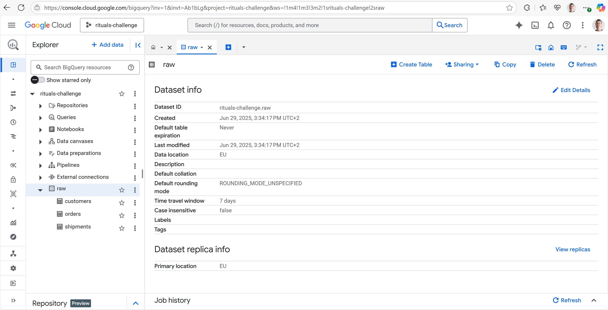
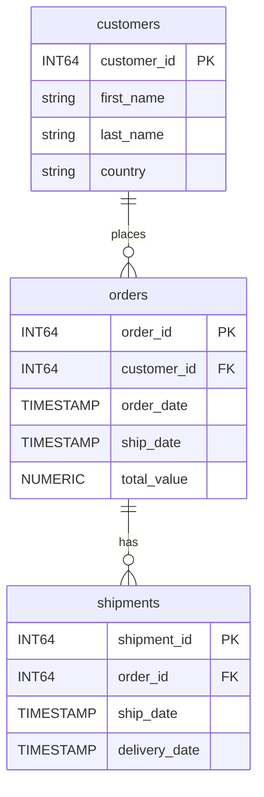
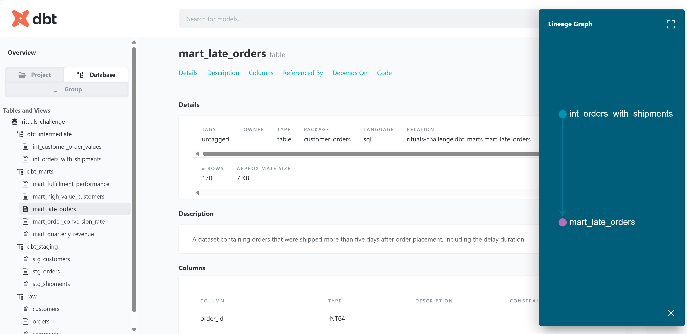

# Customer Orders dbt Project

This project demonstrates how to build a dbt project for analyzing customer order data.

## BigQuery Data Warehouse
The data will be stored in BigQuery. Below is the code to generate dataset and tables for raw data:

```bash
gcloud init

bq mk --location=EU raw

# raw dataset
bq mk --table raw.customers \
row_id:INTEGER,customer_id:STRING,first_name:STRING,last_name:STRING,country:STRING
bq mk --table raw.orders \
order_id:STRING,customer_id:STRING,order_date:STRING,ship_date:STRING,total_value:STRING
bq mk --table raw.shipments \
shipment_id:STRING,order_id:STRING,ship_date:STRING,delivery_date:STRING

# Load data from CSV files
bq load --skip_leading_rows=1 --source_format=CSV raw.customers ./data/customers.csv
bq load --skip_leading_rows=1 --source_format=CSV raw.orders ./data/orders.csv
bq load --skip_leading_rows=1 --source_format=CSV raw.shipments ./data/shipments.csv
```



## Project Structure

```plaintext
customer_orders/
├── README.md: The documentation for the project.
├── dbt_project.yml: The main configuration file for the dbt project.
├── er-diagram.jpg: The entity relationship diagram of the project (jpg).
├── er_diagram.md: The entity relationship diagram of the project (md).
├── logs: Contains the dbt logs.
├── macros: Contains Jinja macros.
├── models: Contains the dbt models.
│   ├── intermediate: Contains intermediate models that are not directly exposed to end-users.
│   │   ├── int_customer_order_values.sql: Calculates the total order value for each customer.
│   │   ├── int_orders_with_shipments.sql: Joins orders and shipments data.
│   │   └── intermediate.yml: Contains the configuration for the intermediate models.
│   ├── marts: Contains the final models that are exposed to end-users.
│   │   ├── mart_fulfillment_performance.sql: Calculates fulfillment performance metrics.
│   │   ├── mart_high_value_customers.sql: Identifies high-value customers.
│   │   ├── mart_late_orders.sql: Identifies late orders.
│   │   ├── mart_order_conversion_rate.sql: Calculates the order conversion rate.
│   │   ├── mart_quarterly_revenue.sql: Calculates the quarterly revenue.
│   │   └── marts.yml: Contains the configuration for the marts models.
│   └── staging: Contains the staging models that clean and prepare the raw data.
│       ├── sources.yml: Defines the raw data sources.
│       ├── staging.yml: Contains the configuration for the staging models.
│       ├── stg_customers.sql: Stages the customers data.
│       ├── stg_orders.sql: Stages the orders data.
│       └── stg_shipments.sql: Stages the shipments data.
├── profiles.yml: The configuration file for connecting to the data warehouse.
├── seeds: Contains seed files (empty).
├── snapshots: Contains dbt snapshots (empty).
└── tests: Contains dbt tests (empty).
```


## Source Configuration
-   **models/staging/sources.yml**: Defines the source tables for orders, shipments, and customers.

### ER Diagram:


## Evaluation Criteria

### 1. Project Setup and Configuration
-   [x] `dbt_project.yml` is correctly configured.
-   [x] `profiles.yml` is set up for the target warehouse (BigQuery).
-   [x] Project models are organized into `staging`, `intermediate`, and `marts` directories.

### 2. Data Modeling
-   [x] **Staging Models**:
    -   [x] Clean, cast, and rename columns from source data.
    -   [x] Implement basic data quality tests (e.g., `unique`, `not_null`).
-   [x] **Intermediate Models**:
    -   [x] Combine staging models to create logical, reusable datasets.
    -   [x] Perform key business logic transformations.
-   [x] **Marts Models**:
    -   [x] Create aggregated, business-focused models for analytics.
    -   [x] Models are performant and logically sound.

#### Output of `dbt run`
```plaintext
06:28:19  Running with dbt=1.10.2
06:28:23  Registered adapter: bigquery=1.9.2
06:28:23  Unable to do partial parsing because saved manifest not found. Starting full parse.
06:28:24  Found 10 models, 25 data tests, 3 sources, 493 macros
06:28:24  
06:28:24  Concurrency: 4 threads (target='dbt')
06:28:24  
06:28:26  1 of 10 START sql table model dbt_staging.stg_customers ........................ [RUN]
06:28:29  1 of 10 OK created sql table model dbt_staging.stg_customers ................... [CREATE TABLE (991.0 rows, 29.2 KiB processed) in 2.71s]
06:28:29  2 of 10 START sql table model dbt_staging.stg_orders ........................... [RUN]
06:28:31  2 of 10 OK created sql table model dbt_staging.stg_orders ...................... [CREATE TABLE (917.0 rows, 49.3 KiB processed) in 2.20s]
06:28:31  3 of 10 START sql table model dbt_intermediate.int_customer_order_values ....... [RUN]
06:28:31  4 of 10 START sql table model dbt_marts.mart_high_value_customers .............. [RUN]
06:28:31  5 of 10 START sql table model dbt_marts.mart_quarterly_revenue ................. [RUN]
06:28:31  6 of 10 START sql table model dbt_staging.stg_shipments ........................ [RUN]
06:28:33  6 of 10 OK created sql table model dbt_staging.stg_shipments ................... [CREATE TABLE (811.0 rows, 49.9 KiB processed) in 1.96s]
06:28:33  7 of 10 START sql table model dbt_intermediate.int_orders_with_shipments ....... [RUN]
06:28:33  3 of 10 OK created sql table model dbt_intermediate.int_customer_order_values .. [CREATE TABLE (592.0 rows, 35.8 KiB processed) in 2.15s]
06:28:33  4 of 10 OK created sql table model dbt_marts.mart_high_value_customers ......... [CREATE TABLE (0.0 rows, 57.6 KiB processed) in 2.19s]
06:28:34  5 of 10 OK created sql table model dbt_marts.mart_quarterly_revenue ............ [CREATE TABLE (1.0 rows, 21.5 KiB processed) in 2.64s]
06:28:35  7 of 10 OK created sql table model dbt_intermediate.int_orders_with_shipments .. [CREATE TABLE (917.0 rows, 54.8 KiB processed) in 2.34s]
06:28:35  8 of 10 START sql table model dbt_marts.mart_fulfillment_performance ........... [RUN]
06:28:35  9 of 10 START sql table model dbt_marts.mart_late_orders ....................... [RUN]
06:28:35  10 of 10 START sql table model dbt_marts.mart_order_conversion_rate ............ [RUN]
06:28:37  10 of 10 OK created sql table model dbt_marts.mart_order_conversion_rate ....... [CREATE TABLE (1.0 rows, 15.5 KiB processed) in 2.07s]
06:28:38  9 of 10 OK created sql table model dbt_marts.mart_late_orders .................. [CREATE TABLE (170.0 rows, 29.8 KiB processed) in 2.32s]
06:28:38  8 of 10 OK created sql table model dbt_marts.mart_fulfillment_performance ...... [CREATE TABLE (1.0 rows, 4.2 KiB processed) in 2.41s]
06:28:38  
06:28:38  Finished running 10 table models in 0 hours 0 minutes and 13.64 seconds (13.64s).
06:28:38  
06:28:38  Completed successfully
06:28:38  
06:28:38  Done. PASS=10 WARN=0 ERROR=0 SKIP=0 NO-OP=0 TOTAL=10
```

### 3. Testing and Documentation
-   [x] All models and sources have descriptions.
-   [x] All model columns are documented.
-   [x] Data tests (`unique`, `not_null`, `relationships`) are applied where appropriate.
-   [x] All tests pass when running `dbt test`.

#### Output of `dbt test`
```plaintext
06:31:01  Running with dbt=1.10.2
06:31:03  Registered adapter: bigquery=1.9.2
06:31:04  Found 10 models, 25 data tests, 3 sources, 493 macros
06:31:04  
06:31:04  Concurrency: 4 threads (target='dbt')
06:31:04  
06:31:05  1 of 25 START test not_null_int_customer_order_values_customer_id .............. [RUN]
06:31:05  2 of 25 START test not_null_int_orders_with_shipments_order_id ................. [RUN]
06:31:05  3 of 25 START test not_null_mart_fulfillment_performance_average_days_to_ship .. [RUN]
06:31:05  4 of 25 START test not_null_mart_high_value_customers_customer_id .............. [RUN]
06:31:05  4 of 25 PASS not_null_mart_high_value_customers_customer_id .................... [PASS in 0.78s]
06:31:05  5 of 25 START test not_null_mart_late_orders_order_id .......................... [RUN]
06:31:05  1 of 25 PASS not_null_int_customer_order_values_customer_id .................... [PASS in 0.83s]
06:31:05  6 of 25 START test not_null_mart_order_conversion_rate_total_orders ............ [RUN]
06:31:05  3 of 25 PASS not_null_mart_fulfillment_performance_average_days_to_ship ........ [PASS in 0.83s]
06:31:05  7 of 25 START test not_null_mart_quarterly_revenue_order_quarter ............... [RUN]
06:31:05  2 of 25 PASS not_null_int_orders_with_shipments_order_id ....................... [PASS in 0.91s]
06:31:05  8 of 25 START test not_null_mart_quarterly_revenue_order_year .................. [RUN]
06:31:06  6 of 25 PASS not_null_mart_order_conversion_rate_total_orders .................. [PASS in 0.82s]
06:31:06  9 of 25 START test not_null_stg_customers_customer_id .......................... [RUN]
06:31:06  7 of 25 PASS not_null_mart_quarterly_revenue_order_quarter ..................... [PASS in 0.83s]
06:31:06  10 of 25 START test not_null_stg_orders_customer_id ............................ [RUN]
06:31:06  5 of 25 PASS not_null_mart_late_orders_order_id ................................ [PASS in 0.90s]
06:31:06  11 of 25 START test not_null_stg_orders_order_date ............................. [RUN]
06:31:06  8 of 25 PASS not_null_mart_quarterly_revenue_order_year ........................ [PASS in 1.01s]
06:31:06  12 of 25 START test not_null_stg_orders_order_id ............................... [RUN]
06:31:07  9 of 25 PASS not_null_stg_customers_customer_id ................................ [PASS in 0.70s]
06:31:07  13 of 25 START test not_null_stg_orders_total_value ............................ [RUN]
06:31:07  11 of 25 PASS not_null_stg_orders_order_date ................................... [PASS in 0.70s]
06:31:07  14 of 25 START test not_null_stg_shipments_order_id ............................ [RUN]
06:31:07  10 of 25 PASS not_null_stg_orders_customer_id .................................. [PASS in 0.75s]
06:31:07  15 of 25 START test not_null_stg_shipments_shipment_id ......................... [RUN]
06:31:07  12 of 25 PASS not_null_stg_orders_order_id ..................................... [PASS in 0.63s]
06:31:07  16 of 25 START test relationships_mart_high_value_customers_customer_id__customer_id__ref_stg_customers_  [RUN]
06:31:08  14 of 25 PASS not_null_stg_shipments_order_id .................................. [PASS in 0.70s]
06:31:08  17 of 25 START test relationships_mart_late_orders_order_id__order_id__ref_stg_orders_  [RUN]
06:31:08  13 of 25 PASS not_null_stg_orders_total_value .................................. [PASS in 0.85s]
06:31:08  18 of 25 START test relationships_stg_orders_customer_id__customer_id__ref_stg_customers_  [RUN]
06:31:08  15 of 25 PASS not_null_stg_shipments_shipment_id ............................... [PASS in 0.88s]
06:31:08  19 of 25 START test relationships_stg_shipments_order_id__order_id__ref_stg_orders_  [RUN]
06:31:08  16 of 25 PASS relationships_mart_high_value_customers_customer_id__customer_id__ref_stg_customers_  [PASS in 0.78s]
06:31:08  20 of 25 START test unique_int_customer_order_values_customer_id ............... [RUN]
06:31:08  18 of 25 PASS relationships_stg_orders_customer_id__customer_id__ref_stg_customers_  [PASS in 0.71s]
06:31:08  21 of 25 START test unique_int_orders_with_shipments_order_id .................. [RUN]
06:31:08  17 of 25 PASS relationships_mart_late_orders_order_id__order_id__ref_stg_orders_  [PASS in 0.87s]
06:31:08  22 of 25 START test unique_mart_high_value_customers_customer_id ............... [RUN]
06:31:09  19 of 25 PASS relationships_stg_shipments_order_id__order_id__ref_stg_orders_ .. [PASS in 0.72s]
06:31:09  23 of 25 START test unique_stg_customers_customer_id ........................... [RUN]
06:31:09  20 of 25 PASS unique_int_customer_order_values_customer_id ..................... [PASS in 0.72s]
06:31:09  24 of 25 START test unique_stg_orders_order_id ................................. [RUN]
06:31:09  22 of 25 PASS unique_mart_high_value_customers_customer_id ..................... [PASS in 0.65s]
06:31:09  25 of 25 START test unique_stg_shipments_shipment_id ........................... [RUN]
06:31:09  23 of 25 PASS unique_stg_customers_customer_id ................................. [PASS in 0.63s]
06:31:09  21 of 25 PASS unique_int_orders_with_shipments_order_id ........................ [PASS in 0.76s]
06:31:09  24 of 25 PASS unique_stg_orders_order_id ....................................... [PASS in 0.75s]
06:31:10  25 of 25 PASS unique_stg_shipments_shipment_id ................................. [PASS in 0.52s]
06:31:10  
06:31:10  Finished running 25 data tests in 0 hours 0 minutes and 6.13 seconds (6.13s).
06:31:10  
06:31:10  Completed successfully
06:31:10  
06:31:10  Done. PASS=25 WARN=0 ERROR=0 SKIP=0 NO-OP=0 TOTAL=25
```

#### Docs console




### 4. Code Quality
-   [x] SQL code is clean, readable, and well-formatted.
-   [x] Use of CTEs to improve readability.
-   [x] `ref()` and `source()` macros are used correctly.

### Using the project

Try running the following commands:
- `dbt run`
- `dbt test`

