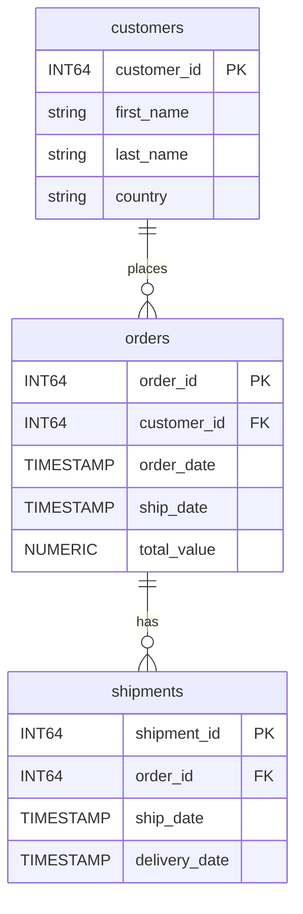

```mermaid
erDiagram
    customers {
        INT64 customer_id PK
        string first_name
        string last_name
        string country
    }
    orders {
        INT64 order_id PK
        INT64 customer_id FK
        TIMESTAMP order_date
        TIMESTAMP ship_date
        NUMERIC total_value
    }
    shipments {
        INT64 shipment_id PK
        INT64 order_id FK
        TIMESTAMP ship_date
        TIMESTAMP delivery_date
    }
    customers ||--o{ orders : "places"
    orders ||--o{ shipments : "has"
```
